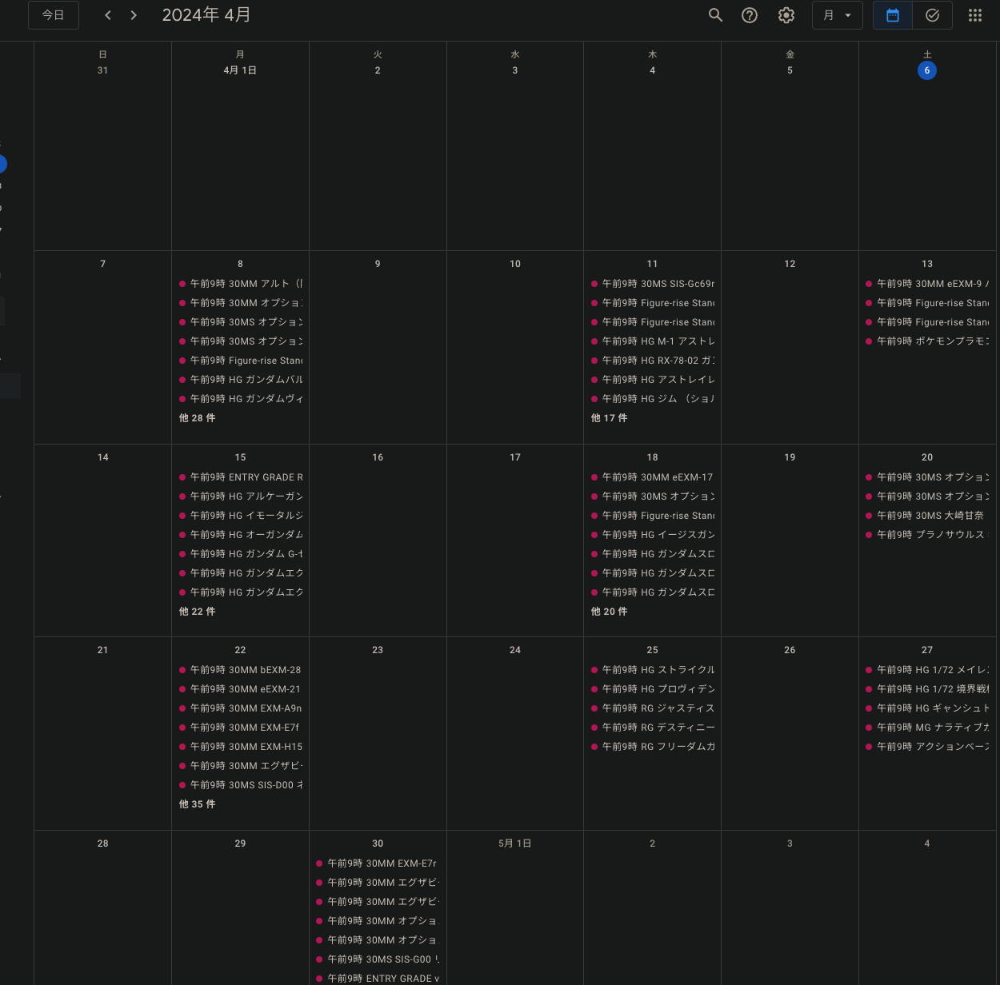

# gunpla-calendar-exporter

確定しているガンプラの発売日 を
任意のカレンダーアプリ等に登録できる `ics` ファイルを出力する。

## URL一覧

| Month | URL |
| :-: | - |
| 2024/04 | <https://storage.cloud.google.com/gunpla-calendar-exporter/2024April.ics> |

## 設定例

### iOS (iPhone/iPad)

* ホーム画面の `設定 (Settings)` を開く
* `パスワードとアカウント (Passwords & Accounts)` -> `アカウントを追加 (Add Account)`
* 一番下の `その他 (Other)`
* 一番下の `照会するカレンダーを追加 (Add Subscribed Calendar)`
* URL を貼り付けて `次へ (Next)`
* そのまま右上の `保存 (Save)`

### Google Calendar (PC)

* icsファイルのリンクをクリックしファイルをダウンロードする。
* `設定` を開く
* 左側メニュー `カレンダーの追加` -> `インポート`
* ダウンロードしたicsを指定し、どのマイカレンダーにインポートするか指定
* `インポート`

もしくは

* `設定` を開く
* 左側メニュー `カレンダーの追加` -> `URL で追加`
* URL を貼り付け
* `カレンダーを追加`

PC から追加後はモバイル版 Google Calendar でも閲覧できる。

## 本ツールをローカル上で実行する場合

本ツールをダウンロードしcmd配下のmain.goを実行することで、自身のGCSバケット及びローカル(本ツール内のgenディレクトリ)へicsファイルを出力させることができる。

ツール実行の手順を以下に記す。
※ goのインストールは済んでいるものとする。

* 本ツールをCloneする。
* 環境変数"GUNPLA_CALENDAR_EXPORTER_ROOT"を定義する。代入する値は本ツールの配置場所を指定する。
  * 例：MacのUser配下にCloneした場合は、"User/{YOUR NAME}/gunpla-calendar-exporter"を代入する。

以下からはGCSへのアップロードを行うための手順となる。ローカルにicsを出力するのみの場合は下記手順は省略して良い。
(アップロード無しの場合は実行時に`-upload false`を実行時引数に指定する。)

* GCPにプロジェクトを立てる。名称は任意で構わないが「gunpla-calendar-exporter」にしておくとソースコードの変更なく以降の手順に進める。
* GCSバケットにstateファイルを管理するバケットを用意する。名称は任意で構わないが「gunpla-calendar-exporter-backend」にしておくとソースコードの変更なく以降の手順に進める。
* CDKTFの使用が可能な状態にする。
  * 特別な手順は必要なく、ぐぐれば出てくるのでここでは詳細は省略する。
* ターミナルで本ツール配下のinfrastructure/envs に移動し、cdktf applyを実行する。
* apply成功後にGCPのコンソールに移動し、サービスアカウントからapp accountという名称のアカウントのキーをJSONで取得する。
* 上記で取得したキー情報のJSONをcmd配下にstorage_key.jsonという名称で配置する。

## appendix

依存ライブラリ

app

* github.com/chromedp/chromedp
* github.com/arran4/golang-ical

infra

* github.com/hashicorp/terraform-cdk-go/cdktf
